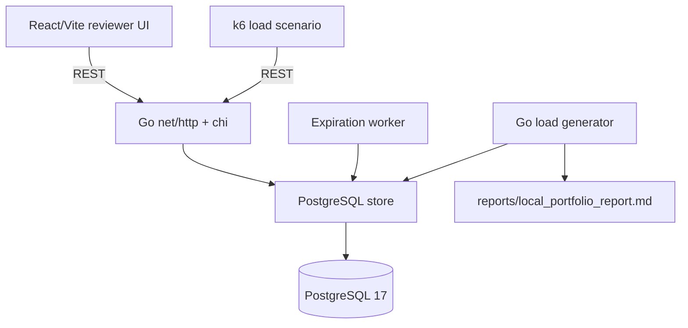
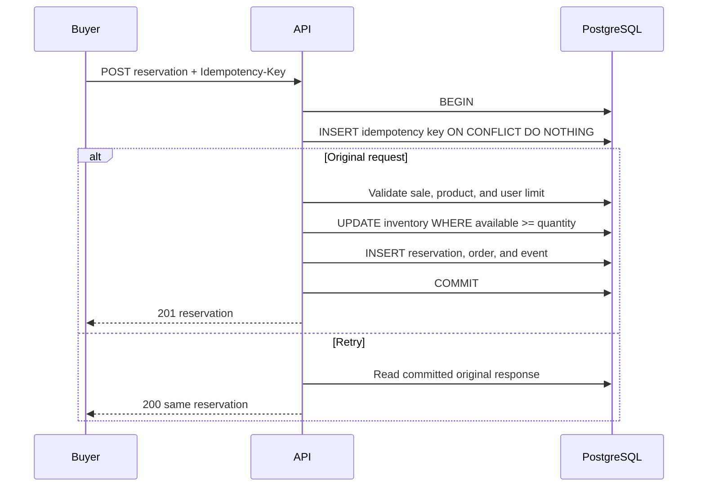
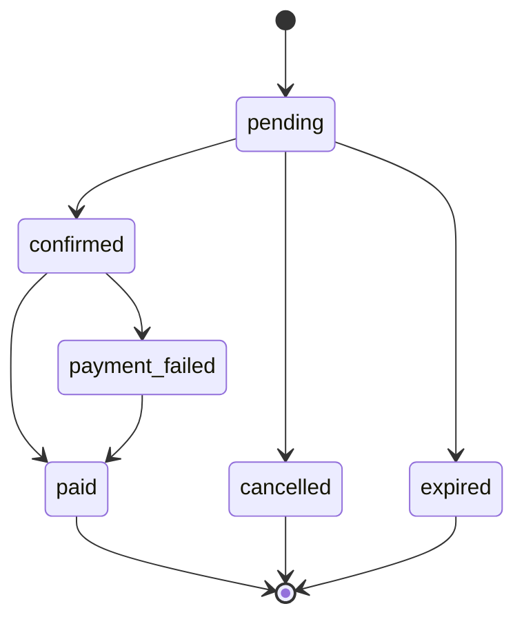

# Architecture

StockRush Go is one deployable Go codebase with separate API, worker, migration, and load-generator commands. Packages are organized by responsibility, but PostgreSQL transactions join operations that must succeed or fail together.

## Reservation flow

## Order state machine

The API never relies on an in-memory mutex for inventory. Multiple processes and worker instances coordinate through PostgreSQL row, advisory, and uniqueness locks.
