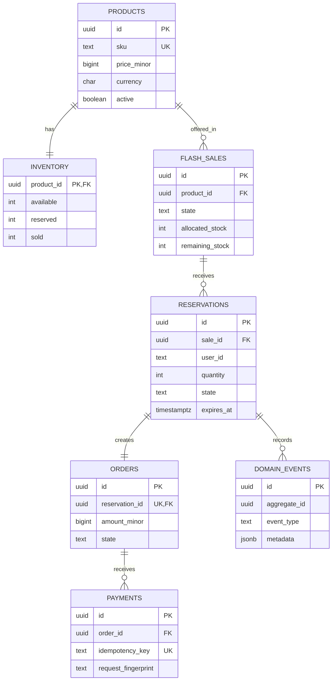

# Database design

All money uses integer minor units. Inventory counters have non-negative check constraints. State values are constrained in SQL, and foreign keys preserve aggregate relationships.

`idempotency_keys.key` is unique. `orders.reservation_id` is unique. These constraints turn concurrent duplicate requests into deterministic replay instead of duplicate effects. Reservations atomically decrement both `inventory.available` and `flash_sales.remaining_stock`; cancellation and expiration restore both counters in the same transaction.

Migrations live in `db/migrations/` and run transactionally through `cmd/migrate`.
