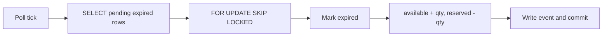

# Reservation expiration worker

The worker polls in configurable batches. Each transaction selects pending expired reservations with `FOR UPDATE SKIP LOCKED`, marks them expired, restores inventory, updates the order, and records a domain event.

Competing worker tests assert that the summed restoration count is one and inventory returns exactly once. Cancellation uses a row lock on the same reservation, so cancellation and expiration cannot both restore it.
